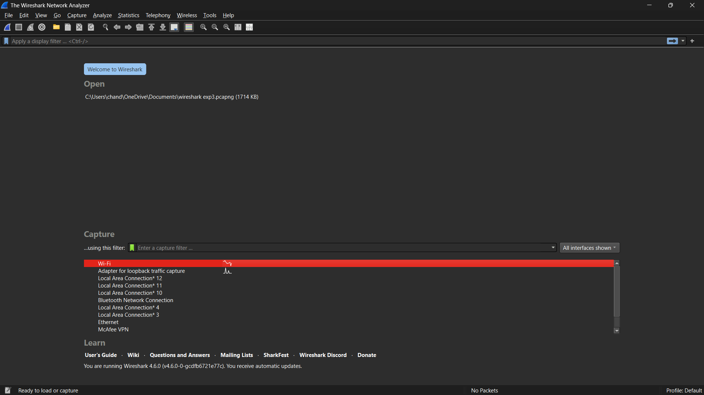

# Configuring Wireshark for Reliable Network Monitoring During Packet Loss

## Aim
To configure Wireshark to ensure reliable network monitoring and minimize packet loss during packet capture.

## Apparatus / Requirements
- Computer system with Wireshark installed  
- Administrator/root privileges on the system  
- Active Network Interface Card (NIC)  
- Internet/network connection  
- Optional tools – Ping or iPerf for traffic generation

## Theory
Wireshark is a network protocol analyzer used to capture and analyze packets traveling through a network. During high traffic, packet loss may occur if the system cannot process or store incoming packets quickly enough.

Common causes of packet loss during capture:
- Insufficient capture buffer size  
- High CPU utilization or low system memory  
- High-speed traffic on the network  
- Incorrect network interface selection

To ensure reliable monitoring, Wireshark must be properly configured — including buffer adjustments, filter usage, and enabling promiscuous mode to capture all traffic passing through the interface.

## Procedure

### Step 1: Identify the Network Interface
1. Open Wireshark → Capture → Options (Ctrl + K).  
   -1.png)
2. Select the correct network interface from the list (look for an active packet count).  
   

### Step 2: Enable Promiscuous Mode
- In Capture Options, enable: **"Capture packets in promiscuous mode"**.  
  This allows Wireshark to capture all packets, not only those addressed to the local machine.

### Step 3: Increase the Capture Buffer Size
- In Capture Options, increase the buffer size from the default (2 MB) to a larger value (e.g., 256 MB or 512 MB).  
  This gives more memory to store packets before writing to disk.

### Step 4: Disable Automatic Capture Stop
1. Go to **Edit → Preferences → Capture**.  
   -1.png)

2. Uncheck: **"Stop capture automatically if buffer is full"**.  
   This prevents Wireshark from halting the capture when the buffer limit is reached.

### Step 5: Apply Capture Filters (Optional)
To reduce CPU and memory load, capture only necessary traffic. Examples:
- `tcp port 80`  
- `host 192.168.1.10`  

Capture filters are applied **before** packets are stored, minimizing load.  
-1.png)

### Step 6: Display Filters (Viewing Captured Packets)
In the display filter bar (the filter input at the top of the packet list), you can filter what is shown **after** capture.  
This does not affect the saved capture — it only narrows which frames are displayed.  

Common display filters include:
- `tcp`
- `http`
- `dns`
- `arp`

Use display filters to quickly focus on protocols or hosts of interest without re-capturing.  
-1.png)

### Step 7: Use Dumpcap for High-Speed Capture
For high-volume captures, use **dumpcap** (command-line tool included with Wireshark). Example:
